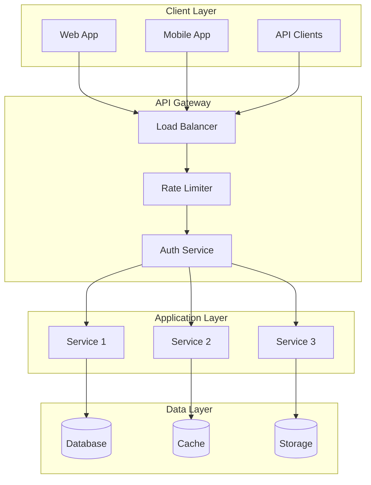
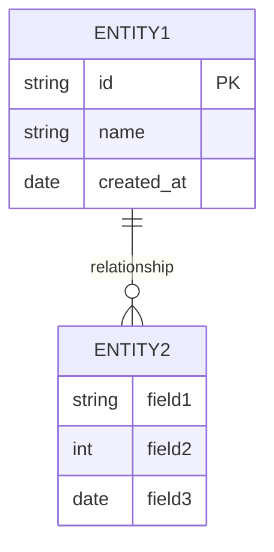

# Architecture Documentation Template

## Overview

**System Name**: [System/Component Name]
**Version**: 1.0.0
**Type**: [System|Component|Service|Platform]
**Status**: [Design|Development|Production|Maintenance]

## Executive Summary

[High-level description of the system, its purpose, and key characteristics]

## Architecture Overview

### System Context
[How this system fits into the larger ecosystem]

### Core Principles
- [Principle 1]: [Explanation and rationale]
- [Principle 2]: [Explanation and rationale]
- [Principle 3]: [Explanation and rationale]

### Key Characteristics
- **Scalability**: [Scaling strategy and limits]
- **Reliability**: [Uptime requirements and fault tolerance]
- **Security**: [Security model and protections]
- **Performance**: [Performance targets and bottlenecks]

## System Architecture

### High-Level Architecture



### Component Breakdown

#### Component 1: [Name]
**Responsibility**: [What it does]
**Technology**: [Tech stack used]
**Interfaces**: [APIs, events, data flows]
**Dependencies**: [Required services/components]

#### Component 2: [Name]
**Responsibility**: [What it does]
**Technology**: [Tech stack used]
**Interfaces**: [APIs, events, data flows]
**Dependencies**: [Required services/components]

## Data Architecture

### Data Model



### Data Flow
1. **Ingestion**: [How data enters the system]
2. **Processing**: [How data is transformed]
3. **Storage**: [How data is persisted]
4. **Retrieval**: [How data is accessed]

### Data Quality
- **Validation**: [Data validation rules]
- **Consistency**: [Consistency guarantees]
- **Backup**: [Backup strategy]
- **Retention**: [Data retention policies]

## API Architecture

### REST API Design
```
GET    /api/v1/resources       # List resources
GET    /api/v1/resources/:id   # Get specific resource
POST   /api/v1/resources       # Create resource
PUT    /api/v1/resources/:id   # Update resource
DELETE /api/v1/resources/:id   # Delete resource
```

### API Schema
```typescript
interface APIResponse<T> {
  success: boolean;
  data?: T;
  error?: {
    code: string;
    message: string;
  };
  metadata: {
    timestamp: Date;
    requestId: string;
  };
}
```

### Authentication & Authorization
- **Authentication**: [JWT/OAuth2/etc.]
- **Authorization**: [RBAC/Permissions/etc.]
- **API Keys**: [For service-to-service communication]

## Security Architecture

### Threat Model
- **Threat 1**: [Description, impact, mitigation]
- **Threat 2**: [Description, impact, mitigation]
- **Threat 3**: [Description, impact, mitigation]

### Security Controls
- **Network Security**: [Firewalls, VPC, etc.]
- **Application Security**: [Input validation, XSS protection, etc.]
- **Data Security**: [Encryption, access controls, etc.]
- **Monitoring**: [Security monitoring and alerting]

## Deployment Architecture

### Infrastructure
- **Cloud Provider**: [AWS/GCP/Azure]
- **Compute**: [EC2/Lambda/Containers]
- **Storage**: [S3/Cloud Storage/etc.]
- **Networking**: [VPC, Load Balancers, CDN]

### Deployment Strategy
- **CI/CD Pipeline**: [GitHub Actions/Jenkins/etc.]
- **Containerization**: [Docker/Kubernetes]
- **Orchestration**: [Kubernetes/EKS/etc.]
- **Monitoring**: [Prometheus/Grafana/etc.]

## Performance Architecture

### Performance Targets
- **Response Time**: [Target latency]
- **Throughput**: [Requests per second]
- **Availability**: [Uptime percentage]
- **Scalability**: [How system scales]

### Performance Optimizations
- **Caching**: [Cache strategy and implementation]
- **Database**: [Indexing, query optimization]
- **CDN**: [Content delivery optimization]
- **Async Processing**: [Background job processing]

## Monitoring & Observability

### Metrics
- **Business Metrics**: [User engagement, conversion, etc.]
- **Technical Metrics**: [CPU, memory, latency, etc.]
- **Error Metrics**: [Error rates, types, etc.]
- **Performance Metrics**: [Response times, throughput, etc.]

### Logging
- **Log Levels**: [DEBUG, INFO, WARN, ERROR]
- **Log Format**: [Structured logging with correlation IDs]
- **Log Storage**: [ELK stack, Cloud Logging, etc.]
- **Log Retention**: [Retention policies]

### Alerting
- **Alert Types**: [Performance, errors, security, etc.]
- **Alert Channels**: [Email, Slack, PagerDuty, etc.]
- **Escalation**: [Alert escalation procedures]

## Operational Procedures

### Deployment Process
1. [Step 1]: [Description]
2. [Step 2]: [Description]
3. [Step 3]: [Description]

### Incident Response
1. **Detection**: [How incidents are detected]
2. **Assessment**: [Impact assessment]
3. **Response**: [Immediate response actions]
4. **Recovery**: [Recovery procedures]
5. **Post-mortem**: [Incident analysis and prevention]

### Backup & Recovery
- **Backup Frequency**: [Daily/weekly/etc.]
- **Backup Storage**: [Location and retention]
- **Recovery Time**: [RTO requirements]
- **Recovery Point**: [RPO requirements]

## Quality Assurance

### Testing Strategy
- **Unit Tests**: [Coverage requirements]
- **Integration Tests**: [Test scenarios]
- **E2E Tests**: [User journey testing]
- **Performance Tests**: [Load testing]

### Code Quality
- **Code Reviews**: [Review requirements]
- **Linting**: [ESLint, Prettier, etc.]
- **Security Scanning**: [SAST, DAST, etc.]
- **Dependency Scanning**: [Vulnerability checks]

## Compliance & Governance

### Regulatory Compliance
- **GDPR**: [Data protection requirements]
- **SOC2**: [Security and availability]
- **Industry Standards**: [Specific industry requirements]

### Governance
- **Change Management**: [Change approval process]
- **Access Management**: [Role-based access control]
- **Audit Trail**: [Audit logging requirements]

## Future Evolution

### Planned Enhancements
- [Enhancement 1]: [Timeline and rationale]
- [Enhancement 2]: [Timeline and rationale]
- [Enhancement 3]: [Timeline and rationale]

### Technology Roadmap
- [Technology 1]: [Adoption timeline]
- [Technology 2]: [Adoption timeline]
- [Technology 3]: [Adoption timeline]

### Scaling Considerations
- [Scaling Challenge 1]: [Solution approach]
- [Scaling Challenge 2]: [Solution approach]
- [Scaling Challenge 3]: [Solution approach]

## Appendices

### Glossary
- **Term 1**: [Definition]
- **Term 2**: [Definition]
- **Term 3**: [Definition]

### References
- [Reference 1]: [Link/Description]
- [Reference 2]: [Link/Description]
- [Reference 3]: [Link/Description]

### Version History
- **v1.0.0** (2024-01-01): Initial architecture documentation
- **v0.5.0** (2023-12-01): Draft architecture design
- **v0.1.0** (2023-11-01): Initial concept

## Contacts

**Architecture Owner**: [Name/Team]
**Technical Lead**: [Name/Team]
**Development Team**: [Team Name]
**Operations Team**: [Team Name]
**Security Team**: [Team Name]
