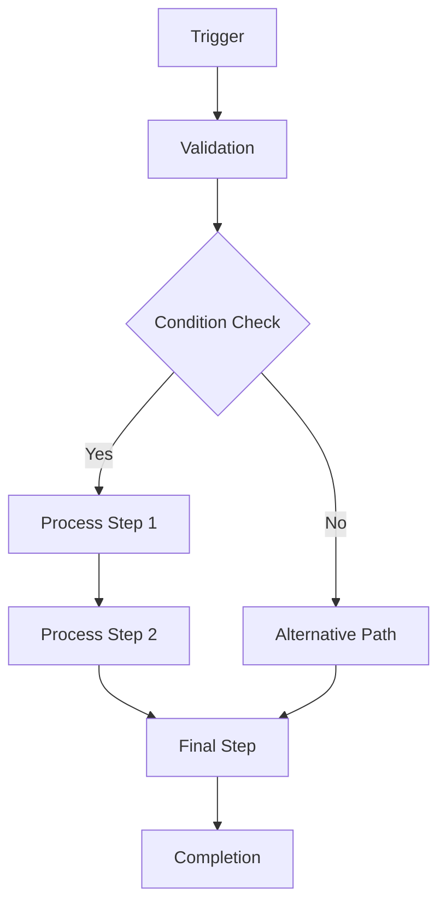

# Workflow Documentation Template

## Overview

**Workflow Name**: [Workflow Name]
**Type**: [Automation|Data Processing|User Interaction|etc.]
**Trigger**: [Manual|Scheduled|Event-based|API]
**Status**: [Active|Development|Testing|Deprecated]

## Description

[Brief description of what this workflow does and when it's used]

## Flow Diagram



## Triggers

### Primary Triggers
- **Manual**: Executed by user/API call
- **Scheduled**: Cron expression `0 9 * * 1` (Every Monday 9 AM)
- **Event-based**: Triggered by [specific event]

### Conditions
- [Condition 1]: [Description]
- [Condition 2]: [Description]

## Steps

### Step 1: [Step Name]
**Type**: [Agent Call|API Request|Data Processing|etc.]
**Input**: [Expected input format]
**Output**: [Expected output format]
**Error Handling**: [Strategy for failures]

```javascript
// Example implementation
async function step1(input) {
  try {
    const result = await agent.process(input);
    return { success: true, data: result };
  } catch (error) {
    return { success: false, error: error.message };
  }
}
```

### Step 2: [Step Name]
**Type**: [Description]
**Dependencies**: [Depends on Step 1]
**Timeout**: [30 seconds]
**Retry Logic**: [3 attempts with exponential backoff]

### Step 3: [Step Name]
**Type**: [Description]
**Parallel Execution**: [Can run in parallel with other steps]
**Conditional**: [Only executes if condition X is met]

## Data Flow

### Input Schema
```typescript
interface WorkflowInput {
  userId: string;
  requestId: string;
  parameters: {
    [key: string]: any;
  };
  metadata?: {
    source: string;
    timestamp: Date;
  };
}
```

### Output Schema
```typescript
interface WorkflowOutput {
  success: boolean;
  result?: any;
  errors?: string[];
  metadata: {
    executionTime: number;
    stepsExecuted: number;
    timestamp: Date;
  };
}
```

## Error Handling

### Error Types
- **ValidationError**: Invalid input data
- **TimeoutError**: Step execution timeout
- **DependencyError**: Required service unavailable
- **ProcessingError**: Business logic failure

### Recovery Strategies
- **Retry**: Automatic retry with backoff
- **Fallback**: Alternative execution path
- **Compensation**: Rollback previous steps
- **Notification**: Alert stakeholders

## Monitoring & Metrics

### Key Metrics
- **Execution Count**: Total workflow runs
- **Success Rate**: Percentage successful executions
- **Average Duration**: Mean execution time
- **Error Rate**: Percentage failed executions

### Alerts
- Success rate < 95%
- Average duration > [threshold]
- Error rate > 5%
- Queue backlog > [threshold]

## Configuration

### Environment Variables
```bash
WORKFLOW_TIMEOUT=300000
WORKFLOW_MAX_RETRIES=3
WORKFLOW_BACKOFF_MULTIPLIER=2
WORKFLOW_ENABLE_LOGGING=true
```

### Runtime Configuration
```json
{
  "steps": [
    {
      "name": "step1",
      "timeout": 30000,
      "retries": 2,
      "enabled": true
    }
  ],
  "conditions": {
    "enableParallel": true,
    "maxConcurrency": 5
  }
}
```

## Testing

### Unit Tests
- [ ] Individual step testing
- [ ] Error condition testing
- [ ] Configuration validation

### Integration Tests
- [ ] End-to-end workflow execution
- [ ] External dependency mocking
- [ ] Performance testing

### Test Scenarios
1. **Happy Path**: All steps succeed
2. **Partial Failure**: Some steps fail but workflow recovers
3. **Complete Failure**: Workflow fails gracefully
4. **Timeout**: Steps exceed time limits
5. **High Load**: Multiple concurrent executions

## Security Considerations

- [Authentication requirements]
- [Authorization checks]
- [Data encryption]
- [Audit logging]

## Performance Optimization

### Bottlenecks
- [Step 1]: [Optimization strategy]
- [Step 2]: [Optimization strategy]

### Caching Strategy
- [Cache input validation results]
- [Cache external API responses]
- [Cache intermediate results]

### Parallelization
- [Steps that can run in parallel]
- [Concurrency limits]
- [Resource allocation]

## Usage Examples

### API Trigger
```javascript
const response = await fetch('/api/workflows/execute', {
  method: 'POST',
  headers: { 'Content-Type': 'application/json' },
  body: JSON.stringify({
    workflowId: 'workflow-name',
    input: { userId: '123', data: 'input' }
  })
});
```

### Programmatic Execution
```javascript
import { WorkflowEngine } from './workflow-engine';

const engine = new WorkflowEngine();
const result = await engine.execute('workflow-name', inputData);
```

## Maintenance

### Regular Tasks
- [ ] Monitor performance metrics
- [ ] Update step implementations
- [ ] Review error logs
- [ ] Test failure scenarios

### Troubleshooting
- **Issue 1**: [Root cause and solution]
- **Issue 2**: [Root cause and solution]

## Changelog

### v1.0.0 (2024-01-01)
- Initial workflow implementation
- Basic step execution
- Error handling added

## Future Enhancements

- [ ] Feature 1: [Description]
- [ ] Feature 2: [Description]
- [ ] Optimization 1: [Description]

## Related Workflows

- [Related workflow 1]: [Relationship]
- [Related workflow 2]: [Relationship]

## Contacts

**Owner**: [Team/Person]
**Maintainer**: [Team/Person]
**Documentation**: [Link]
**Issues**: [Link]
